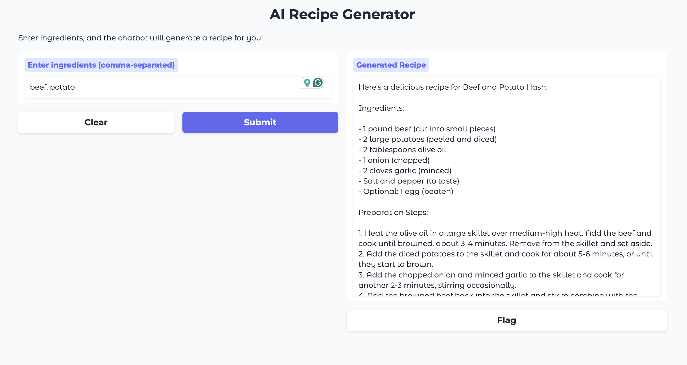

# ID2223 Lab2
Group 25 - Mengmeng Yang, Zong-rong Yang

## Task1: Llama 3.2 Fine-tuning Pipeline

### Dataset
- [**mlabonne/FineTome-100K**](https://huggingface.co/datasets/mlabonne/FineTome-100k) dataset
- ShareGPT format conversations, standardized to HuggingFace format
### Model
- Base Model: Llama-3.2 3B Instruct (4-bit)

Llama-3.2 3B Instruct is Meta's latest compact instruction-tuned model, offering a balanced solution for fine-tuning tasks. The model comes with built-in conversation templates, making it particularly suitable for dialogue-based applications.

### Unsloth Optimization
Unsloth significantly enhances the training pipeline by providing a 2x speedup in both training and inference phases. It implements 4-bit quantization to reduce memory usage while maintaining model quality.

### Key Steps
1. **Model Loading:**
Load a pretrained Llama-3.2 model with 4-bit quantization:
     ```python
     model, tokenizer = FastLanguageModel.from_pretrained(
         model_name="unsloth/Llama-3.2-3B-Instruct",
         max_seq_length=2048,
         load_in_4bit=True,
     )
     ```

2. **LoRA Integration:**
LoRA parameters are set for fine-tuning:
     ```python
     model = FastLanguageModel.get_peft_model(
         model,
         r=16,
         target_modules=["q_proj", "k_proj", "v_proj", "o_proj"],
         lora_alpha=16,
         lora_dropout=0,
         use_gradient_checkpointing="unsloth",
     )
     ```

3. **Data Preparation:**
Standardize a ShareGPT-style dataset to a Hugging Face-compatible format and then formats the conversations using a specific chat template (llama-3.1) to prepare the data for model fine-tuning.

4. **Training Setup:**
Training uses the `SFTTrainer` from Hugging Face's TRL:
     ```python
     trainer = SFTTrainer(
         model=model,
         tokenizer=tokenizer,
         train_dataset=dataset,
         max_seq_length=2048,
         args=TrainingArguments(
             per_device_train_batch_size=2,
             max_steps=60,
             learning_rate=2e-4,
             fp16=True,
         ),
     )
     ```


### Inference Pipeline

Due to deployment issues on Hugging Face Spaces, we decided to implement the inference pipeline using Colab. The model has been customized to function as a **recipe generator chatbot**. Users can input a list of ingredients, and the chatbot will generate a detailed recipe, including preparation steps and tips. 



## Task2: Improve pipeline scalability and model performance

### Model-Centric Approach

### Data-Centric Approach
In this task, we explored how incrementally increasing training data sizes affects language model performance. We utilized three versions of the Model. The baseline model, Model 1, was trained on 100k data points from mlabonne/FineTome-100k. For the subsequent models, we expanded the training data by adding additional samples randomly selected from arcee-ai/The-Tome. Specifically, Model 2 included an additional 100k data points for a total of 200k, and Model 3 included an additional 200k data points from The Tome, accumulating a total of 300k data points.

#### Model Evaluation Summary
The models were evaluated on four diverse tasks using the ROUGE scoring system, focusing on ROUGE-1, ROUGE-2, and ROUGE-L metrics. Each model was run three times to ensure consistency and to calculate standard deviations.

| Model | Data Size | Average ROUGE-1 | Average ROUGE-2 | Average ROUGE-L | Standard Deviation (ROUGE-1) | Standard Deviation (ROUGE-2) | Standard Deviation (ROUGE-L) |
|-------|-----------|-----------------|-----------------|-----------------|------------------------------|------------------------------|------------------------------|
| Model 1 | 100k | 0.407 | 0.163 | 0.300 | 0.012 | 0.003 | 0.007 |
| Model 2 | 200k | 0.402 | 0.157 | 0.301 | 0.019 | 0.020 | 0.009 |
| Model 3 | 300k | 0.397 | 0.146 | 0.304 | 0.019 | 0.011 | 0.006 |

#### Observations
The results indicated a slight decrease in ROUGE-1 and ROUGE-2 scores with increasing amounts of training data, while ROUGE-L scores showed minimal variation across the models. Unexpectedly, augmenting the training data did not lead to improved performance, suggesting possible issues with data quality or model capacity.

#### Future Directions
Future efforts will focus on refining data quality and tuning model parameters. Additional exploration of alternative metrics for a more comprehensive performance assessment is also planned. Moreover, adjustments in preprocessing and data enhancement strategies will be considered to better leverage the expanded datasets based on the FineTome-100k and further random selections from `The Tome`.